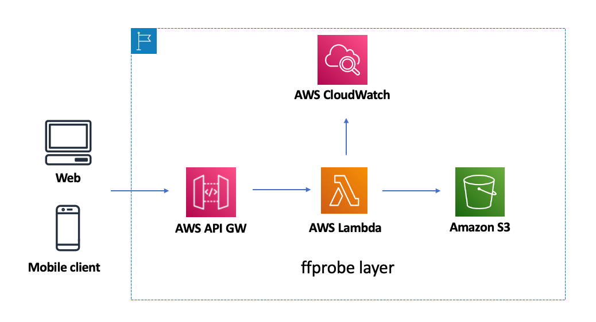
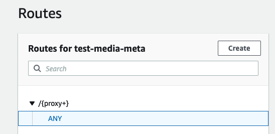
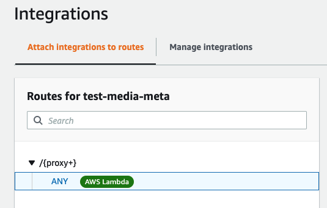

# serverless-media-meta-golang

## Architecture

* By integrating the ffprobe layer, metadata information of mp4 and mp3 can be obtained.

* Use the api gateway http mode to define the location of the file stored in the s3 bucket according to the URL path

## Api gateway route config

## Api gateway integrations config

